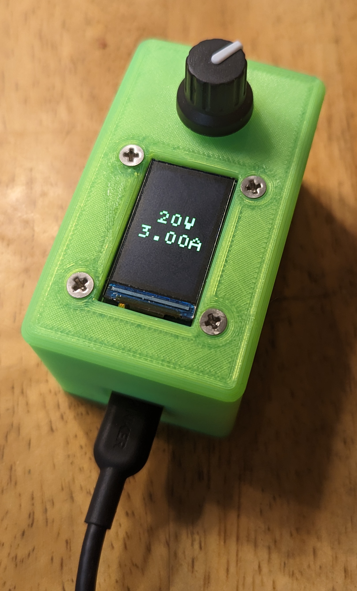
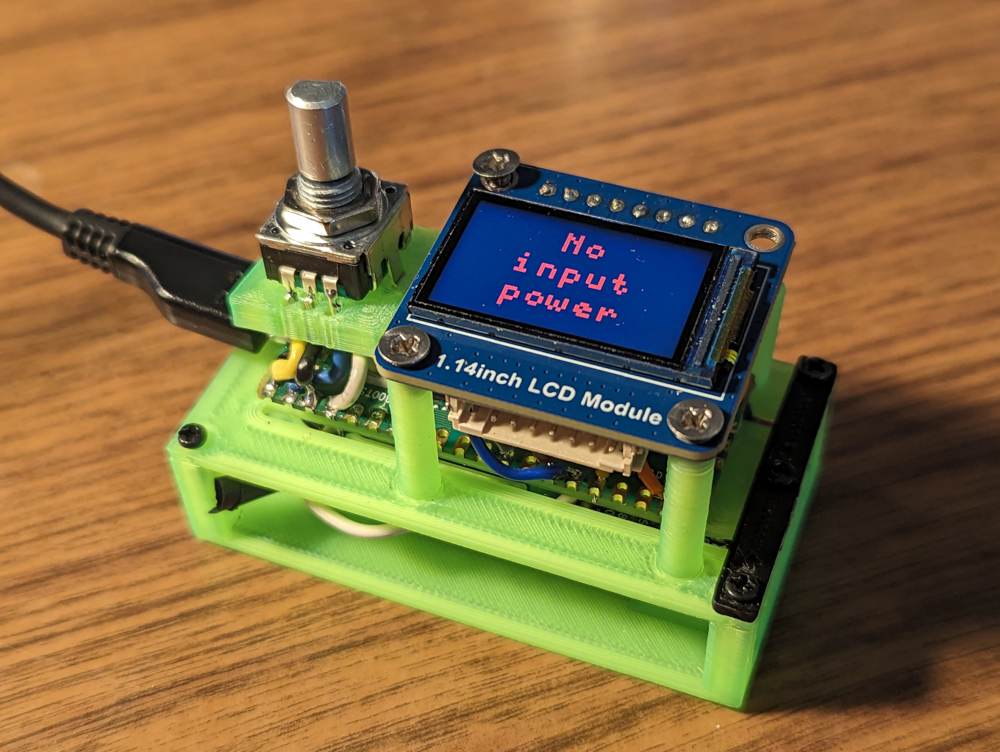

# Introduction



This device provides power from a USB PD source (such as a cheap modern
phone charger) to a pair of screw terminals, and lets the user select
the voltage and max current from among what the PD source offers.

USB PD sources typically offer one or more voltages (5V, 9V, 12V, 15V,
18V, and 20V), each with its own current limit.


# Design

This device is based on the HUSB238 USB PD Sink chip and an RP2040
microcontroller (Raspberry Pi Pico).

The user interface is a small screen and a rotary-encoder/push-button
knob.  The UI shows the active power, and lets the user select among
the alternatives offered by the USB-PD Source.

The device also includes a Mini360 buck converter to power the 3.3V
control electronics from whatever voltage the USB PD source is currently
supplying.  The buck converter powers the Pico via its VSYS input
(protected by an 1N5817 Schottky diode).  The HUSB238 can't provide
power below 5V, so it does not need a boost converter.  This way you
can plug the Pico into a computer via USB for development/debugging and
"UI-over-serial", even while it's connected to a 20V USB-PD source.

The Pico talks I2C to the HUSB238.

The Pico talks SPI to the display.


## Bill of materials

HUSB238:
* <https://www.adafruit.com/product/5807>
* <https://en.hynetek.com/2421.html>

RP2040 (Raspberry Pi Pico, non-H variant, i.e. the one without pin
headers):
* <https://www.raspberrypi.com/products/raspberry-pi-pico/>

Mini360:
* <https://components101.com/modules/mini360-dc-dc-buck-converter-module>
* <https://www.ebay.com/itm/132416658988>

1N5817 Schottky diode

1.14 inch color LCD display module, 240x135:
* <https://www.waveshare.com/1.14inch-lcd-module.htm>
* <https://www.waveshare.com/wiki/1.14inch_LCD_Module>

Rotary/push-button knob:
* <https://www.adafruit.com/product/377>

Panel mount screw terminals:
* <https://www.ebay.com/itm/301753692259>
* <https://www.ebay.com/itm/302724734282>

Custom 3d printed enclosure (FCStd & STLs in this repo)

Misc fasteners (see below)

Misc hookup wire, mostly 24 AWG stranded or similar, plus a short length
of red & black in 18 AWG.


# Enclosure

The enclosure is 3d printed from the FreeCAD file in this repo.
The plastic parts include standoffs with holes that I drill to size and
tap M2.  This works surprisingly well.

The screen is mounted with #4-40 flat head screws because they're about
the right size and it's what I happened to have on hand, though maybe
M2.5 would have been more consistent.


## Design

The enclosure is designed to make the device easy to assemble and easy
to work on.  You can have all the the electronics assembled and mounted,
but have the case off so everything is visible and accessible (including
the micro-USB connector on the Pico used to flash the firmware).



The stack looks like this, starting at the bottom:

1.  The "base-plate" holds the HUSB238 and Mini360.  It has standoffs
    for the mid-plate.

2.  The "mid-plate" is mounted on the standoffs of the base-plate.
    It has standoffs for mounting the Pico, and standoffs for the screen.
    There are slots in the mid-plate that allow easy wiring from below
    (power from the Mini360 and I2C to the HUSB238).

3.  The "lid" or "case" is an inverted bowl that sits on top of the
    mid-plate.  The screen and the encoder knob both mount to the lid.
    The screws that attach the screen to the lid go into the standoffs
    on the mid-plate.  The encoder knob is panel-mounted to the lid with
    its own nut and washer.

You can unscrew the screen screws and the nut on the encoder knob and
take the lid off, and run the whole thing without the case.  You can
attach the screen to its standoffs on the mid-plate without the lid
(though the encoder knob has nowhere other than the lid to mount to,
so it's free floating in this configuration).


## Slicer

I configured my slicer to print 5 perimeters, to make the standoffs
stronger and more able to take a tap.

I configured my slicer to print the first layer at elevated temperatures,
to aid with print-bed adhesion and avoid corner lifting: 210°C nozzle,
65°C bed.  The rest of the part is printed at 190°C/60°C.  This is
working great.


## Fasteners

The enclosure is printed in pieces that screw together.  A clearance
hole in one part aligns with a matching threaded hole in another part,
and a screw holds them together.

Most fasteners are M2, except for the flat-heads that hold the lid on
the enclosure, those are M2.6.

M2 clearance holes should be 2.200 mm diameter, and are specified so in
the CAD model.  If your printer prints the holes undersized you may have
to drill them out with a #44 drill.

M2 threaded holes should be "pre-drilled" to 1.6 mm, and are specified
so in the CAD model.  If your printer prints the holes undersized you
may have to drill them out with a #52 drill.

M2.6 clearance holes are 2.7 mm, drill to size with a #36 drill.

M2.6 threaded holes are 2.26 mm, drill to size with a #43 drill.

I've tried two options for the threaded holes:

* M2 tapped holes and machine screws.  I tap gently by hand, being
  careful to not shear the fragile standoffs on the weak layer lines.
  This works well, but tapping all those holes is pretty labor intensive.

* M2 self-tapping "wood" screws.  This is much quicker, as the holes don't
  need to be tapped.  I just screw the screws in.  This also works well,
  but has the slight downside that the tapered points of the self-tapping
  screws take up some extra space.

screen to lid to mid-plate:
* 4x m2.6x6 self-tapping flat head

pico to mid-plate:
* 4x m2x4 self-tapping button head

mid-plate end-cap to mid-plate:
* 1x m2x4 self-tapping button head

mid-plate to base-plate:
* 4x m2x6 self-tapping button head

husb238 to base-plate:
* 2x m2x6 self-tapping button head

screw terminal to case:
* 2x m2x6 self-tapping button head

total:
* 4x m2.6x6 self-tapping flat head

* 5x m2x4 self-tapping button head

* 8x m2x6 self-tapping button head


# Assembly


## Enclosure prep


### M2 threaded holes

There are several holes that will take M2 threads:
* 6x on the Base-Plate
* 5x on the Mid-Plate
* 2x on the Lid

Drill these holes #52 (0.0635 inch, 1.613 mm).

FIXME: or slightly bigger?  The printed plastic standoffs are quite
fragile and the self-tapping screws apply enough force to
crack the standoffs on the layer lines.  1.6 mm (#52) or 1.75 mm (#50).
#51 (0.067 inch, 1.702 mm) works well.


### M2 clearance holes

There are several holes that need to pass M2 screws with clearance:
* 4x on the Mid-Plate
* 3x on the Mid-Plate End-Cap

Drill these #44 (0.086inch, 2.184mm).


### M2.6 threaded holes

There are several holes that need to take M2.6 threads:
* 4x screen standoffs on the Mid-Plate

Drill these holes #43 (0.089 inch, 2.261 mm).

FIXME: or slightly bigger?


### M2.6 clearance holes

Drill the M2.6 clearance holes in the lid #30 (0.129 inch, 3.264 mm).


## Base plate

Solder the I2C leads on the HUSB238.  Blue for SDA, yellow for SCK.
These are about 20 mm long.

Solder power leads to the HUSB238 board, one pair long to go to the
screw terminal and one pair short to go to the Mini360.

Solder the short power leads from the HUSB238 to the input points on
the Mini360.

Solder a ground wire to the Mini360 OUT- pad.  Solder a Schottky diode to
the OUT+ pad, but *do not* connect it anywhere yet.  Note: the diode does
not fit through the slot in the mid-plate, so ensure there's an adequate
lead on the Pico side, and ensure that it's well covered by shrink tubing.

Mount the HUSB238 and Mini360 to the base-plate.

Connect the HUSB238 to power and adjust the pot on the Mini360 to get
about 3.3V after the diode (any voltage in the range ~2.3V to ~5.5V will
work well).


## Mid plate

Mount the mid-plate on its standoffs on the base-plate.  The standoffs
for the screen are on the same side of the device as the HUSB238.

Mount the Pico on its standoffs on the mid-plate.  The USB connector and
BOOTSEL button should be on the side that's *not* covered by the display.

Route the 3.3V and GND output lines from the Mini360 through the slots
in the mid-plate to pins 39 (VSYS) an 38 (GND) and solder them in place.


### Connect the HUSB238 to the Pico

Solder the I2C leads as follows:

```
Name | Pico pin | Direction | HUSB238 | Color
-----+----------+-----------+---------+-------
SDA  | 21       | <->       | SDA     | blue
SCL  | 22       |  ->       | SCL     | yellow
```


### Connect the rotary encoder knob to the Pico

Solder the leads as follows:

* Size the leads so that the top of the square body of the rotary
encoder (just under the washer & nut) is level with the tops of the
screen standoffs.

```
Pico GPIO | Pico Pin | Knob pin
----------+----------+-----------
GPIO 0    | 1        | A
GND       | 3        | C (center on 3-pin side)
GPIO 1    | 2        | B
----------+----------+-----------
GND       | 38       | either pin on 2-pin side
GPIO 2    | 4        | other pin on 2-pin side
----------+----------+-----------
```

* If the side with the three pins is facing you, with the shaft up,
then the pins are A, C, B.

* When stripping the wire to solder to the pico, very short exposed
conductors are sufficient, 2mm or so.


### Connect the display to the PICO

Temporarily mount the display on its standoffs.

Solder leads between Pico and the vias on the display board.  Bring the
wires up from the underside of the display board and clip any excess wire
on the top side flush with the board, to avoid interfering with the lid.

```
Pico Name          | Pico Pin | Direction | Display
-------------------+----------+-----------+--------
3.3V               | 36       |  ->       | VCC
GND                | 23       | <->       | GND
spi1 TX (GPIO 15)  | 20       |  ->       | DIN
spi1 SCK (GPIO 14) | 19       |  ->       | CLK
GPIO 12            | 16       |  ->       | CS
GPIO 11            | 15       |  ->       | D/C
GPIO 10            | 14       |  ->       | RST
PWM 4B (GPIO 9)    | 12       |  ->       | BL
```

Note: We solder individual wires rather than using the connector on the
screen because the connector comes out the side and interferes with the
case wall.


## Lid

Remove the temporary screws holding the screen on its standoffs.

Remove the nut & washer from the rotary encoder knob.

Slide the lid carefully over the main assembly.

* The rotary encoder knob should come up through its hole.  Attach it
with its washer and nut.

* Align the mounting holes in the screen with the holes in the lid and
in the standoffs, and screw it securely into place.
